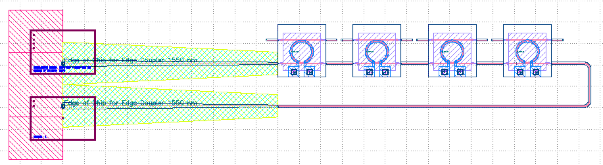
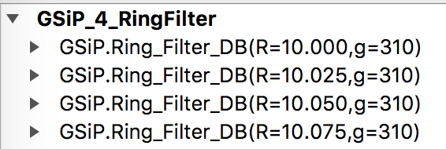
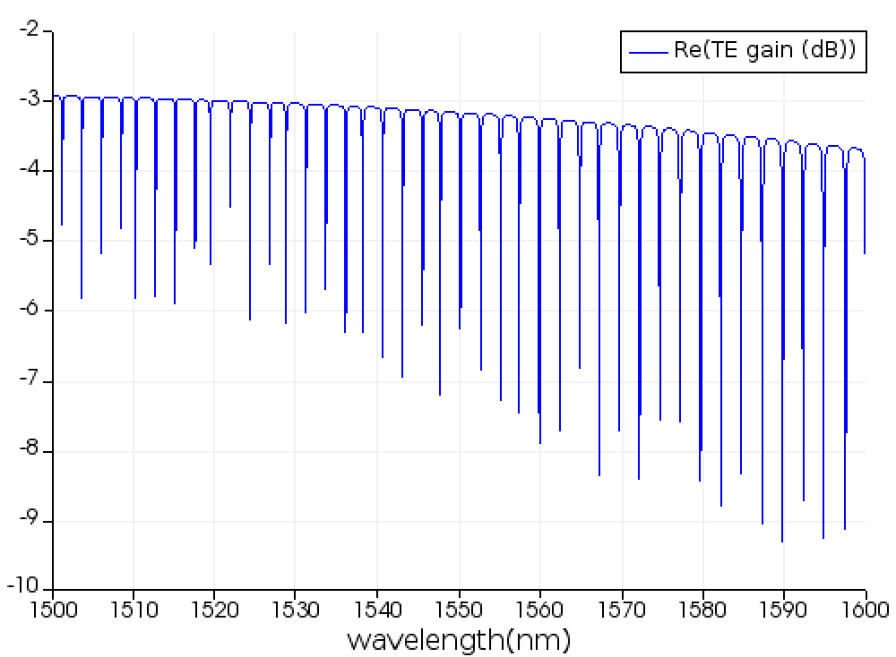

# GSiP 4-Channel WDM Ring Modulator - Ring Filter Transceiver

## Ring Modulator Analysis

### Layout: GSiP_1_RingMod_gds

* Open the layout using KLayout, with the SiEPIC-Tools package installed

	* 

* menu SiEPIC | Simulation | Setup Lumerical INTERCONNECT Compact Model Library

	* ensure that the GSiP Compact Model Library is correctly loaded in INTERCONNECT.

* menu SiEPIC | Verification | Graphical Layout Check

	* Check that the layout is correct (ignore DFT error opt_in label missing).

### Frequency domain analysis

* menu SiEPIC | Simulation | Circuit Simulation: Lumerical INTERCONNECT

	* Observe the transmission spectrum of the chip, with the modulator at 0 V.

	* 

* Characterize the modulator PN junction and heater:

	* In INTERCONNECT, open the LSF file: GSiP_1_RingMod_Analysis_DC.lsf
	* Edit the file to turn on the PN junction sweep: SIM_PN = 1.
	* Choose the voltages, e.g., -0.5 V to 4 V, in amplitude_values.
	* Run the LSF file

	* 

	* Determine the appropriate wavelength for the continuous wave (CW) laser, e.g., 1547.4 nm.
	* Perform additional sweeps to explore the heater and PN junction performance.

### Time domain analysis

* Characterize the ring modulator in the time domain:

	* In INTERCONNECT, open the LSF file: GSiP_1_RingMod_Analysis_TimeDomain.lsf
	* Configure the CW laser wavelength as per above
	* Configure the modulation parameters: bit rate and sequence length
	* Run the LSF file
	* Observe the time domain oscilloscope measurement:

	* 

	* Find the eye diagram element in the design. Observe the Extinction Ratio.
	* Right-click on EYE_1 and select Display Results.  

	* 

	* Observe the eye diagram

	* 

### Layout: GSiP_4_RingFilter_gds

* Open the layout using KLayout, with the SiEPIC-Tools package installed. Note that there are four ring resonator filters, each with slightly different radii so that they have different resonance frequencies.

	* 
	* 

* menu SiEPIC | Verification | Graphical Layout Check

	* Check that the layout is correct (ignore DFT error opt_in label missing).

### Frequency domain analysis

* menu SiEPIC | Simulation | Circuit Simulation: Lumerical INTERCONNECT

	* Observe the transmission spectrum of the chip. Note that there are now 4 times more resonances, owning to the four rings. 

	* 

* The ring resonator peaks should match the wavelengths set on the transmitter and the CW laser.
