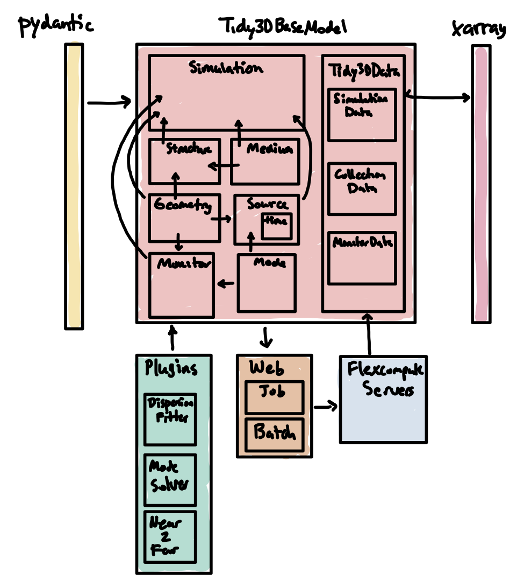

# Tidy3d Package Structure

This document explains the organization of the `tidy3d` package defined in this directory and some of the design decisions.

## Design Overview

The principal goal of the `tidy3d` python client is define the parameters that are needed to run a simulation.
Because the solver itself is closed source, these parameters are encapsulated in a `.json` file, which is sent to our sever using the `tidy3d.web` interface.
As such, the goals of this package are simply:

1. to create the simulation `.json` files.
2. to provide an API for managing and monitoring jobs on the server.
3. to provide convenient ways to.
  - create and set various parameters in the simulation files.
  - visualize the simulation components.
  - load and analyze the data.

### Components

The various components of `tidy3d` are designed to mirror the `.json` file structure almost exactly.
Therefore, the arguments supplied to the components in almost all cases are stored directly in the .json files.
We maintain code for loading these parameters into our solver in the closed-source package on our server.
This makes things easy to reason about and keeps the client code simple.

#### Pydantic

We leverage the [`pydantic`](https://pydantic-docs.helpmanual.io) package to define these components, which has the following benefits:
- Less boilerplate code, including pre-processing, writing `__init__` and other methods, the code is easier to read and edit.
- `pydantic` provides methods for checking types validating arguments so we can catch incorrect .json files before trying to run them.
- It is very simple to export json files and schema definitions, which makes life easy when we change anything in the code.
- Many more advantages as described [here](https://pydantic-docs.helpmanual.io/#rationale).

### Plugins

Because it is not always straightforward to come up with the parameters for many components, we provide some plugins for letting users design their own components.
Some examples include:
- Mode solver.
- Dispersive material fitting tool.
- Near field to far field transformation tool.

These plugins will import and export tidy3d components, but the `tidy3d` components should never depend on them.
In this sense, one can think of them as additional wrappers that use `tidy3d`'s core components library to do various useful things.
We should consider encouraging open source developers to contribute various plugins in the future.

### Web API

The webAPI as defined in `web/` is used to talk to the server and provides a set of API calls and convenience objects for managing jobs.

### Constants

Several physical constants are defined in `constants.py` as well as the default value for various parameters, like `td.inf`.

### Miscellaneous

The `log` module provides methods for error handling and logging information.
The `material_library` module provides a list of material models from published data.
